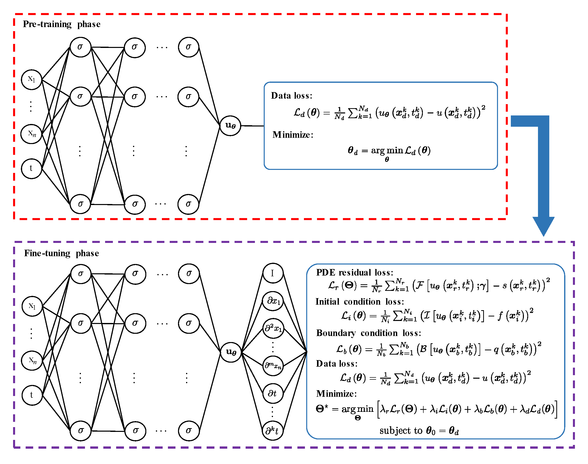

# DG-PINNs
Data-guided physics-informed neural networks.

•	DG-PINNs: A novel two-phase framework for solving inverse problems in PDEs.\
•	Pre-training phase focuses on data loss; fine-tuning phase embeds physical laws.\
•	Improves efficiency and maintains accuracy compared to existing PINNs.

# Schematic of DG-PINNs
Here we show the schematic of DG-PINNs for solving inverse problems in PDEs.

  

